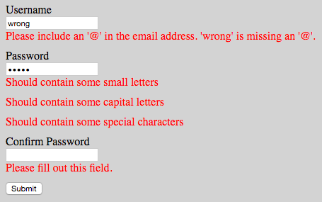

# ReactFormWithConstraints

Simple form validation for React in [~350 lines of code](src/FormWithConstraints.tsx)

[](https://travis-ci.org/tkrotoff/ReactFormWithConstraints)

- Installation: `npm install react-form-with-constraints`
- CDN: https://unpkg.com/react-form-with-constraints/dist/react-form-with-constraints.js

## Introduction: what is HTML5 form validation?

```HTML
<form>
  <label>Email:</label>
  <input type="email" required>
  <button>Submit</button>
</form>
```


The `required` HTML5 attribute specifies that the user must fill in a value. Other available attributes: `min`, `max`, `minlength`, `maxlength`, `pattern`... see [MDN documentation - Form data validation](https://developer.mozilla.org/en-US/docs/Learn/HTML/Forms/Form_validation).

[`type="email"`](https://developer.mozilla.org/en-US/docs/Web/HTML/Element/input/email) checks that the entered text looks like an email address. Other available input types: `checkbox`, `date`, `number`, `password`, `tel`, `text`, `url`... see [MDN documentation - Form input types](https://developer.mozilla.org/en-US/docs/Web/HTML/Element/input#Form_<input>_types).

## What ReactFormWithConstraints brings

- Control HTML5 error messages: `<FieldFeedback when="valueMissing">My custom error message</FieldFeedback>`
- Custom constraints beyond HTML5: `<FieldFeedback when={value => ...}>`
- Warnings: `<FieldFeedback ... warning>`
- Infos: `<FieldFeedback ... info>`
- Multiple feedbacks: `<FieldFeedbacks ... show="all">`

```JSX
<input type="password" name="password"
       value={this.state.password} onChange={this.handleChange}
       pattern=".{5,}" required />
<FieldFeedbacks for="password" show="all">
  <FieldFeedback when="valueMissing" />
  <FieldFeedback when="patternMismatch">Should be at least 5 characters long</FieldFeedback>
  <FieldFeedback when={value => !/\d/.test(value)} warning>Should contain numbers</FieldFeedback>
  <FieldFeedback when={value => !/[a-z]/.test(value)} warning>Should contain small letters</FieldFeedback>
  <FieldFeedback when={value => !/[A-Z]/.test(value)} warning>Should contain capital letters</FieldFeedback>
  <FieldFeedback when={value => !/\W/.test(value)} warning>Should contain special characters</FieldFeedback>
</FieldFeedbacks>
```

The API works the same way as [React Router v4](https://reacttraining.com/react-router/web/example/basic):

```JSX
<Router>
  <Route exact path="/" component={Home} />
  <Route path="/news" component={NewsFeed} />
</Router>
```

It is also inspired by [AngularJS ngMessages](https://docs.angularjs.org/api/ngMessages#usage).

## ReactFormWithConstraints demo

- CodePen demo: https://codepen.io/tkrotoff/pen/BRGdqL
- CodePen Bootstrap demo: https://codepen.io/tkrotoff/pen/oWQeQR



## API

The API reads like this: "for field when constraint violation display feedback", example:
```JSX
<FieldFeedbacks for="password">
  <FieldFeedback when="valueMissing" />
  <FieldFeedback when="patternMismatch">Should be at least 5 characters long</FieldFeedback>
</FieldFeedbacks>
```
```
for field "password" when constraint violation "valueMissing"    display "the default HTML5 feedback"
                     when constraint violation "patternMismatch" display "Should be at least 5 characters long"
```

- `FieldFeedbacks`
  - `for: string` => refer to a `name` attribute, e.g `<input name="password">`
  - `show?: 'first' | 'all'` => display the first error/warning encountered (default) or all of them
  - `children: FieldFeedback[]`

- `FieldFeedback`
  - `when: `[`ValidityState`](https://developer.mozilla.org/en-US/docs/Web/API/ValidityState)` string | '*' | function` => HTML5 constraint violation name or a callback
  - `error?: boolean` => treat the feedback as an error (default)
  - `warning?: boolean` => treat the feedback as a warning
  - `info?: boolean` => treat the feedback as an info
  - `children?: string` => the text to display or the default HTML5 text if `undefined`

- `FormWithConstraints`
  - `handleChange(e: React.FormEvent<Input>): void` => needs to be called whenever an `input` from the `form` changes
  - `handleSubmit(e: React.FormEvent<HTMLFormElement>): void`
  - `hasErrors(...fieldNames: string[]): boolean`
  - `hasWarnings(...fieldNames: string[]): boolean`
  - `hasInfos(...fieldNames: string[]): boolean`
  - `isValid(): boolean`

## Browser support

You can use HTML5 attributes like `type="email"`, `required`, `pattern`..., in this case a [recent browser](http://caniuse.com/#feat=forms) is needed,...

```JSX
<form onSubmit={this.handleSubmit} noValidate>
  <label>Username</label>

  <input type="email" name="username"
         value={this.state.username} onChange={this.handleChange}
         required />
  <FieldFeedbacks for="username">
    <FieldFeedback when="*" />
  </FieldFeedbacks>

  <button>Submit</button>
</form>
```

...or ignore them and rely on `when` functions:

```JSX
<form onSubmit={this.handleSubmit} noValidate>
  <label>Username</label>

  <input name="username"
         value={this.state.username} onChange={this.handleChange} />
  <FieldFeedbacks for="username">
    <FieldFeedback when={value => value.length === 0}>Please fill out this field.</FieldFeedback>
    <FieldFeedback when={value => !/\S+@\S+/.test(value)}>Invalid email address.</FieldFeedback>
  </FieldFeedbacks>

  <button>Submit</button>
</form>
```

In the last case you will have to manage translations yourself.

## Notes

I do not like to inherit from `FormWithConstraints`, if you find a better solution tell me.
