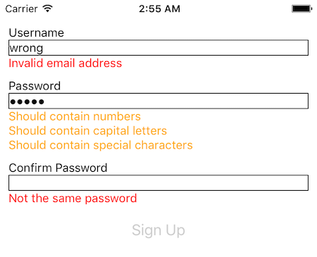
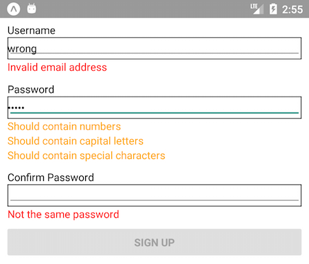

# react-form-with-constraints

[](https://badge.fury.io/js/react-form-with-constraints)
[](https://travis-ci.org/tkrotoff/react-form-with-constraints)
[](https://codecov.io/gh/tkrotoff/react-form-with-constraints)
[](https://bundlephobia.com/result?p=react-form-with-constraints@latest)
[](https://github.com/prettier/prettier)
[](https://github.com/airbnb/javascript)

Simple form validation for React

- Installation: `npm install react-form-with-constraints`
- CDN: https://unpkg.com/react-form-with-constraints/dist/

Check the [changelog](CHANGELOG.md) for breaking changes and fixes between releases.

## Introduction: what is HTML5 form validation?

⚠️ [Client side validation is cosmetic, you should not rely on it to enforce security](https://stackoverflow.com/q/162159)

```HTML
<form>
  <label for="email">Email:</label>
  <input type="email" id="email" required>
  <button type="submit">Submit</button>
</form>
```


The `required` HTML5 attribute specifies that the user must fill in a value, [`type="email"`](https://developer.mozilla.org/en-US/docs/Web/HTML/Element/input/email) checks that the entered text looks like an email address.

Resources:

- [Making Forms Fabulous with HTML5](https://www.html5rocks.com/en/tutorials/forms/html5forms/)
- [Constraint Validation: Native Client Side Validation for Web Forms](https://www.html5rocks.com/en/tutorials/forms/constraintvalidation/)
- [MDN - Form data validation](https://developer.mozilla.org/en-US/docs/Learn/HTML/Forms/Form_validation)
- [MDN - Form input types](https://developer.mozilla.org/en-US/docs/Web/HTML/Element/input#Form_<input>_types)
- [UX Research Articles - Usability Testing of Inline Form Validation](https://baymard.com/blog/inline-form-validation)

## What react-form-with-constraints brings

- Minimal API and footprint
- Unobtrusive: easy to adapt regular [React code](https://reactjs.org/docs/forms.html)
- HTML5 error messages personalization: `<FieldFeedback when="valueMissing">My custom error message</FieldFeedback>`
- Custom constraints: `<FieldFeedback when={value => ...}>`
- Warnings and infos: `<FieldFeedback ... warning>`, `<FieldFeedback ... info>`
- Async validation
- No dependency beside React (no Redux, MobX...)
- Re-render only what's necessary
- Easily extendable
- [Bootstrap 4](examples/Bootstrap4) styling with npm package `react-form-with-constraints-bootstrap4`
- [Material-UI](examples/MaterialUI) integration with npm package `react-form-with-constraints-material-ui`
- Support for [React Native](examples/ReactNative) with npm package `react-form-with-constraints-native`
- ...

```JSX
<input type="password" name="password"
       value={this.state.password} onChange={this.handleChange}
       required pattern=".{5,}" />
<FieldFeedbacks for="password">
  <FieldFeedback when="valueMissing" />
  <FieldFeedback when="patternMismatch">
    Should be at least 5 characters long
  </FieldFeedback>
  <FieldFeedback when={value => !/\d/.test(value)} warning>
    Should contain numbers
  </FieldFeedback>
  <FieldFeedback when={value => !/[a-z]/.test(value)} warning>
    Should contain small letters
  </FieldFeedback>
  <FieldFeedback when={value => !/[A-Z]/.test(value)} warning>
    Should contain capital letters
  </FieldFeedback>
</FieldFeedbacks>
```

## Examples

- CodePen basic Password example: https://codepen.io/tkrotoff/pen/BRGdqL ([CodeSandbox version](https://codesandbox.io/s/github/tkrotoff/react-form-with-constraints/tree/master/examples/Password))

  

- [Bootstrap 4 example (React hooks)](https://codesandbox.io/s/github/tkrotoff/react-form-with-constraints/tree/master/examples/Bootstrap4)
- [Material-UI example (React hooks)](https://codesandbox.io/s/github/tkrotoff/react-form-with-constraints/tree/master/examples/MaterialUI)
- [WizardForm example (React hooks)](https://codesandbox.io/s/github/tkrotoff/react-form-with-constraints/tree/master/examples/WizardForm)
- [SignUp example (React classes)](https://codesandbox.io/s/github/tkrotoff/react-form-with-constraints/tree/master/examples/SignUp)
- [ClubMembers example (React classes + MobX)](https://codesandbox.io/s/github/tkrotoff/react-form-with-constraints/tree/master/examples/ClubMembers)
- [Password without state example (React hooks)](https://codesandbox.io/s/github/tkrotoff/react-form-with-constraints/tree/master/examples/PasswordWithoutState)

- [React Native example (React classes)](examples/ReactNative):

  | iOS                                                   | Android                                                       |
  | ----------------------------------------------------- | ------------------------------------------------------------- |
  |  |  |

- Other examples from [the examples directory](examples):
  - [Plain old React form validation example (React hooks)](https://codesandbox.io/s/github/tkrotoff/react-form-with-constraints/tree/master/examples/PlainOldReact)
  - [React with HTML5 constraint validation API example (React hooks)](https://codesandbox.io/s/github/tkrotoff/react-form-with-constraints/tree/master/examples/HTML5ConstraintValidationAPI)
  - [Server-side rendering example (React hooks)](examples/ServerSideRendering)

## How it works

The API works the same way as [React Router](https://reacttraining.com/react-router/web/example/basic):

```JSX
<Router>
  <Route exact path="/" component={Home} />
  <Route path="/news" component={NewsFeed} />
</Router>
```

It is also inspired by [AngularJS ngMessages](https://docs.angularjs.org/api/ngMessages#usage).

If you had to implement validation yourself, you would end up with [a global object that tracks errors for each field](examples/PlainOldReact/App.tsx).
react-form-with-constraints [works similarly](packages/react-form-with-constraints/src/FieldsStore.ts).
It uses [React context](https://reactjs.org/docs/legacy-context.html) to share the [`FieldsStore`](packages/react-form-with-constraints/src/FieldsStore.ts) object across [`FieldFeedbacks`](packages/react-form-with-constraints/src/FieldFeedbacks.tsx) and [`FieldFeedback`](packages/react-form-with-constraints/src/FieldFeedback.tsx).

## API

The API reads like this: "for field when constraint violation display feedback", example:

```JSX
<FieldFeedbacks for="password">
  <FieldFeedback when="valueMissing" />
  <FieldFeedback when="patternMismatch">Should be at least 5 characters long</FieldFeedback>
</FieldFeedbacks>
```

```
for field "password"
  when constraint violation "valueMissing"    display <the HTML5 error message (*)>
  when constraint violation "patternMismatch" display "Should be at least 5 characters long"
```

(\*) [element.validationMessage](https://www.w3.org/TR/html51/sec-forms.html#the-constraint-validation-api)

Async support works as follow:

```JSX
<FieldFeedbacks for="username">
  <Async
    promise={checkUsernameAvailability} /* Function that returns a promise */
    then={available => available ?
      <FieldFeedback key="1" info style={{color: 'green'}}>Username available</FieldFeedback> :
      <FieldFeedback key="2">Username already taken, choose another</FieldFeedback>
      // Why key=*? Needed otherwise React gets buggy when the user rapidly changes the field
    }
  />
</FieldFeedbacks>
```

Trigger validation:

```JSX
function MyForm() {
  const form = useRef(null);

  async function handleChange({ target }) {
    // Validates only the given fields and returns Promise<Field[]>
    await form.current.validateFields(target);
  }

  async function handleSubmit(e) {
    e.preventDefault();

    // Validates the non-dirty fields and returns Promise<Field[]>
    await form.current.validateForm();

    if (form.current.isValid()) console.log('The form is valid');
    else console.log('The form is invalid');
  }

  return (
    <FormWithConstraints ref={form} onSubmit={handleSubmit} noValidate>
      <input
        name="username"
        onChange={handleChange}
        required minLength={3}
      />
      <FieldFeedbacks for="username">
        <FieldFeedback when="tooShort">Too short</FieldFeedback>
        <Async
          promise={checkUsernameAvailability}
          then={available => available ?
            <FieldFeedback key="1" info style={{color: 'green'}}>Username available</FieldFeedback> :
            <FieldFeedback key="2">Username already taken, choose another</FieldFeedback>
          }
        />
        <FieldFeedback when="*" />
      </FieldFeedbacks>
    </FormWithConstraints>
  );
}
```

<br>

**Important note:**

If a field (i.e an `<input>`) does not have a matching `FieldFeedbacks`, the library won't known about this field (and thus won't perform validation).
The field name should match `FieldFeedbacks.for`:

```JSX
<input name="MY_FIELD" ...>
<FieldFeedbacks for="MY_FIELD">
  ...
</FieldFeedbacks>
```

<br>
<br>

- [`FieldFeedbacks`](packages/react-form-with-constraints/src/FieldFeedbacks.tsx)

  - `for: string` => reference to a `name` attribute (e.g `<input name="username">`), should be unique to the current form
  - `stop?: 'first' | 'first-error' | 'first-warning' | 'first-info' | 'no'` =>
    when to stop rendering `FieldFeedback`s, by default stops at the first error encountered (`FieldFeedback`s order matters)

  Note: you can place `FieldFeedbacks` anywhere, have as many as you want for the same `field`, nest them, mix them with `FieldFeedback`... Example:

  ```JSX
  <input name="username" ... />

  <FieldFeedbacks for="username" stop="first-warning">
    <FieldFeedbacks>
      <FieldFeedback ... />
      <Async ... />
      <FieldFeedbacks stop="first-info">
        ...
      </FieldFeedbacks>
    </FieldFeedbacks>

    <FieldFeedback ... />
    <Async ... />
  </FieldFeedbacks>

  <FieldFeedbacks for="username" stop="no">
    ...
  </FieldFeedbacks>
  ```

- [`FieldFeedback`](packages/react-form-with-constraints/src/FieldFeedback.tsx)

  - `when?`:
    - [`ValidityState`](https://developer.mozilla.org/en-US/docs/Web/API/ValidityState) as a string => HTML5 constraint violation name
    - `'*'` => matches any HTML5 constraint violation
    - `'valid'` => displays the feedback only if the field is valid
    - `(value: string) => boolean` => custom constraint
  - `error?: boolean` => treats the feedback as an error (default)
  - `warning?: boolean` => treats the feedback as a warning
  - `info?: boolean` => treats the feedback as an info
  - `children` => what to display when the constraint matches; if missing, displays the [HTML5 error message](https://www.w3.org/TR/html51/sec-forms.html#the-constraint-validation-api) if any

- [`Async<T>`](packages/react-form-with-constraints/src/Async.tsx) => Async version of `FieldFeedback` (similar API as [react-promise](https://github.com/capaj/react-promise))

  - `promise: (value: string) => Promise<T>` => a promise you want to wait for
  - `pending?: React.ReactNode` => runs when promise is pending
  - `then?: (value: T) => React.ReactNode` => runs when promise is resolved
  - `catch?: (reason: any) => React.ReactNode` => runs when promise is rejected

- [`FormWithConstraints`](packages/react-form-with-constraints/src/FormWithConstraints.tsx)

  - `validateFields(...inputsOrNames: Array<Input | string>): Promise<Field[]>` =>
    Should be called when a `field` changes, will re-render the proper `FieldFeedback`s (and update the internal `FieldsStore`).
    Without arguments, all fields (`$('[name]')`) are validated.

  - `validateFieldsWithoutFeedback(...inputsOrNames: Array<Input | string>): Promise<Field[]>` =>
    Validates only all non-dirty fields (won't re-validate fields that have been already validated with `validateFields()`),
    If you want to force re-validate all fields, use `validateFields()`.
    Might be renamed to `validateNonDirtyFieldsOnly()` or `validateFieldsNotDirtyOnly()` in the future?

  - `validateForm(): Promise<Field[]>` =>
    Same as `validateFieldsWithoutFeedback()` without arguments, typically called before to submit the `form`.
    Might be removed in the future?

  - `isValid(): boolean` => should be called after `validateFields()`, `validateFieldsWithoutFeedback()` or `validateForm()`, indicates if the fields are valid

  - `hasFeedbacks(): boolean` => indicates if any of the fields have any kind of feedback

  - `resetFields(...inputsOrNames: Array<Input | string>): Field[]` =>
    Resets the given fields and re-render the proper `FieldFeedback`s.
    Without arguments, all fields (`$('[name]')`) are reset.

  - [`Field`](packages/react-form-with-constraints/src/Field.ts) =>
    ```TypeScript
    {
      name: string;
      validations: { // FieldFeedbackValidation[]
        key: number;
        type: 'error' | 'warning' | 'info' | 'whenValid';
        show: boolean | undefined;
      }[];
      isValid: () => boolean
    }
    ```

- [`Input`](packages/react-form-with-constraints/src/Input.tsx)

  If you want to style `<input>`, use `<Input>` instead: it will add classes `is-pending`, `has-errors`, `has-warnings`, `has-infos` and/or `is-valid` on `<input>` when the field is validated.

  Example: `<Input name="username" />` can generate `<input name="username" class="has-errors has-warnings">`

  FYI `react-form-with-constraints-bootstrap4` and `react-form-with-constraints-material-ui` already style the fields to match their respective frameworks.

## Browser support

react-form-with-constraints needs [`ValidityState`](https://developer.mozilla.org/en-US/docs/Web/API/ValidityState) which is supported by all modern browsers and IE 11.
It also needs a polyfill such as [core-js](https://github.com/zloirock/core-js) to support IE 11, see [React JavaScript Environment Requirements](https://reactjs.org/docs/javascript-environment-requirements.html).

You can use HTML5 attributes like `type="email"`, `required`, [`minlength`](https://caniuse.com/#feat=input-minlength)...

```JSX
<label htmlFor="email">Email</label>
<input type="email" name="email" id="email"
       value={this.state.email} onChange={this.handleChange}
       required />
<FieldFeedbacks for="email">
  <FieldFeedback when="*" />
</FieldFeedbacks>
```

...and/or rely on `when` functions:

```JSX
<label htmlFor="email">Email</label>
<input name="email" id="email"
       value={this.state.email} onChange={this.handleChange} />
<FieldFeedbacks for="email">
  <FieldFeedback when={value => value.length === 0}>Please fill out this field.</FieldFeedback>
  <FieldFeedback when={value => !/\S+@\S+/.test(value)}>Invalid email address.</FieldFeedback>
</FieldFeedbacks>
```

In the last case you will have to manage translations yourself (see SignUp example).

## How to consume the npm packages?

### ESNext (currently ES2018) + ES modules

Files inside [`lib/`](https://unpkg.com/react-form-with-constraints@latest/lib/) (package.json `"module": "lib/index.js"`).

A recent browser or Node.js is required or you will need to transpile the react-form-with-constraints source code using Babel (or TypeScript tsc).

Several advantages:

- The combine use of `"sideEffects": false` with `"module": ...` generates a smaller bundle thanks to [tree shaking](https://webpack.js.org/guides/tree-shaking/)
- You can transpile react-form-with-constraints source code with your Babel's [preset-env](https://babeljs.io/docs/en/babel-preset-env) and [Browserslist](https://github.com/browserslist/browserslist) configuration

For this to work, do not exclude `node_modules` from your webpack configuration, example:

```JS
// webpack.config.js
module: {
  rules: [
    {
      test: /\.jsx?$/,

      //exclude: /node_modules/,
      // [Babel should not transpile core-js](https://github.com/zloirock/core-js/issues/514#issuecomment-476533317)
      exclude: /\/core-js/,

      loader: 'babel-loader'
    }
  ]
}
```

```JS
// babel.config.js
module.exports = {
  presets: [
    [
      '@babel/preset-env',
      {
        useBuiltIns: 'entry',
        corejs: 3
      }
    ],
    '@babel/preset-react'
  ],
  plugins: [
    '@babel/plugin-proposal-class-properties',
    '@babel/plugin-proposal-object-rest-spread'
  ]
};
```

### ES5 + CommonJS

Classic ES5 transpilation, files inside [`lib-es5/`](https://unpkg.com/react-form-with-constraints@latest/lib-es5/) (package.json `"main": "lib-es5/index.js"`).
No tree shaking.

### UMD (Universal Module Definition) + ES5

Files inside [`dist/`](https://unpkg.com/react-form-with-constraints@latest/dist/).
Typical use is with `<script src="react-form-with-constraints.production.min.js">` inside your index.html.

A good use case is [CodePen](https://codepen.io/tkrotoff/pen/BRGdqL), files are generated by [Rollup](packages/react-form-with-constraints/rollup.config.js).

## Notes

- A [`type="hidden"`](https://developer.mozilla.org/en-US/docs/Web/HTML/Element/input/hidden#Validation), [`readonly`](https://developer.mozilla.org/en-US/docs/Web/HTML/Element/input#attr-readonly) or [`disabled`](https://developer.mozilla.org/en-US/docs/Web/HTML/Element/input#attr-disabled) input won't trigger any HTML5 form constraint validation like [`required`](https://developer.mozilla.org/en-US/docs/Web/HTML/Element/input#attr-required), see https://codepen.io/tkrotoff/pen/gdjVNv
