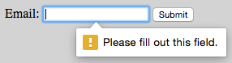
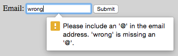
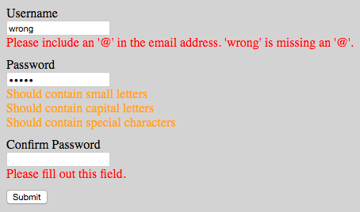

# react-form-with-constraints

[](https://badge.fury.io/js/react-form-with-constraints)
[](https://travis-ci.org/tkrotoff/react-form-with-constraints)
[](https://codecov.io/gh/tkrotoff/react-form-with-constraints)
[](https://unpkg.com/react-form-with-constraints/dist/react-form-with-constraints.production.min.js.gz)

Simple form validation for React in [~400 lines of code](src)

- Installation: `npm install react-form-with-constraints`
- CDN: https://unpkg.com/react-form-with-constraints/dist/

## Introduction: what is HTML5 form validation?

```HTML
<form>
  <label for="email">Email:</label>
  <input type="email" id="email" required>
  <button>Submit</button>
</form>
```



The `required` HTML5 attribute specifies that the user must fill in a value, [`type="email"`](https://developer.mozilla.org/en-US/docs/Web/HTML/Element/input/email) checks that the entered text looks like an email address.

Resources:
- [Making Forms Fabulous with HTML5](https://www.html5rocks.com/en/tutorials/forms/html5forms/)
- [Constraint Validation: Native Client Side Validation for Web Forms](https://www.html5rocks.com/en/tutorials/forms/constraintvalidation/)
- [MDN - Form data validation](https://developer.mozilla.org/en-US/docs/Learn/HTML/Forms/Form_validation)
- [MDN - Form input types](https://developer.mozilla.org/en-US/docs/Web/HTML/Element/input#Form_<input>_types)

## What react-form-with-constraints brings

- Minimal API and footprint
- Control HTML5 error messages: `<FieldFeedback when="valueMissing">My custom error message</FieldFeedback>`
- Custom constraints: `<FieldFeedback when={value => ...}>`
- Warnings and infos: `<FieldFeedback ... warning>`, `<FieldFeedback ... info>`
- No dependency beside React (no Redux, MobX...)
- No special component like `<TextField>`, just plain old `<input>` or whatever you like
- Re-render only what's necessary
- ...

```JSX
<input type="password" name="password"
       value={this.state.password} onChange={this.handleChange}
       required pattern=".{5,}" />
<FieldFeedbacks for="password" show="all">
  <FieldFeedback when="valueMissing" />
  <FieldFeedback when="patternMismatch">
    Should be at least 5 characters long
  </FieldFeedback>
  <FieldFeedback when={value => !/\d/.test(value)} warning>
    Should contain numbers
  </FieldFeedback>
  <FieldFeedback when={value => !/[a-z]/.test(value)} warning>
    Should contain small letters
  </FieldFeedback>
  <FieldFeedback when={value => !/[A-Z]/.test(value)} warning>
    Should contain capital letters
  </FieldFeedback>
  <FieldFeedback when={value => !/\W/.test(value)} warning>
    Should contain special characters
  </FieldFeedback>
</FieldFeedbacks>
```

## Examples

- CodePen basic example: https://codepen.io/tkrotoff/pen/BRGdqL
- CodeSandbox Bootstrap 4 example: https://codesandbox.io/s/qk0zro1qm4
- CodeSandbox WizardForm example: https://codesandbox.io/s/my0ojyzq6p
- CodeSandbox SignUp example: https://codesandbox.io/s/62qwozvm0k
- CodeSandbox ClubMembers example: https://codesandbox.io/s/q8364yn60j



Other examples inside [the examples directory](examples).

## How it works

The API works the same way as [React Router v4](https://reacttraining.com/react-router/web/example/basic):

```JSX
<Router>
  <Route exact path="/" component={Home} />
  <Route path="/news" component={NewsFeed} />
</Router>
```

It is also inspired by [AngularJS ngMessages](https://docs.angularjs.org/api/ngMessages#usage).

If you had to implement validation yourself, you would end up with [a global object that tracks errors for each field](examples/NoFramework/App.tsx).
react-form-with-constraints [works](src/Fields.ts) [similarly](src/FieldsStore.ts) (although not using [`setState`](https://reactjs.org/docs/react-component.html#setstate)).
It uses [React context](https://facebook.github.io/react/docs/context.html#parent-child-coupling) to share the [`FieldsStore`](src/FieldsStore.ts) object across [`FieldFeedbacks`](src/FieldFeedbacks.tsx) and [`FieldFeedback`](src/FieldFeedback.tsx).

## API

The API reads like this: "for field when constraint violation display feedback", example:
```JSX
<FieldFeedbacks for="password">
  <FieldFeedback when="valueMissing" />
  <FieldFeedback when="patternMismatch">Should be at least 5 characters long</FieldFeedback>
</FieldFeedbacks>
```
```
for field "password"
  when constraint violation "valueMissing"    display "the HTML5 error message (*)"
  when constraint violation "patternMismatch" display "Should be at least 5 characters long"
```

(*) [element.validationMessage](https://www.w3.org/TR/html51/sec-forms.html#the-constraint-validation-api)

- `FieldFeedbacks`
  - `for: string` => refer to a `name` attribute (e.g `<input name="username">`), should be unique to the current form
  - `show?: 'first' | 'all'` => display the first error/warning encountered (default) or all of them

  Note: you can place `FieldFeedbacks` anywhere and have as many as you want for the same `field`

- `FieldFeedback`
  - `when: `[`ValidityState`](https://developer.mozilla.org/en-US/docs/Web/API/ValidityState)` string | '*' | function` => HTML5 constraint violation name or a callback
  - `error?: boolean` => treat the feedback as an error (default)
  - `warning?: boolean` => treat the feedback as a warning
  - `info?: boolean` => treat the feedback as an info

- `FormWithConstraints`
  - `validateFields(...inputsOrNames: Array<Input | string>): void` => should be called when a `field` changes or the `form` is submitted, will re-render the proper `FieldFeedbacks`
  - `isValid(): boolean`

## Browser support

You can use HTML5 attributes like `type="email"`, `required`, `pattern`..., in this case a [recent browser](http://caniuse.com/#feat=forms) is needed,...

```JSX
<label htmlFor="username">Username</label>
<input type="email" name="username" id="username"
       value={this.state.username} onChange={this.handleChange}
       required />
<FieldFeedbacks for="username">
  <FieldFeedback when="*" />
</FieldFeedbacks>
```

...or ignore them and rely on `when` functions:

```JSX
<label htmlFor="username">Username</label>
<input name="username" id="username"
       value={this.state.username} onChange={this.handleChange} />
<FieldFeedbacks for="username">
  <FieldFeedback when={value => value.length === 0}>Please fill out this field.</FieldFeedback>
  <FieldFeedback when={value => !/\S+@\S+/.test(value)}>Invalid email address.</FieldFeedback>
</FieldFeedbacks>
```

In the last case you will have to manage translations yourself.

react-form-with-constraints, like React 16, depends on the collection types [Map](https://developer.mozilla.org/en-US/docs/Web/JavaScript/Reference/Global_Objects/Map) and [Set](https://developer.mozilla.org/en-US/docs/Web/JavaScript/Reference/Global_Objects/Set).
If you support older browsers (<IE11) you will need a global polyfill such as [core-js](https://github.com/zloirock/core-js) or [babel-polyfill](https://babeljs.io/docs/usage/polyfill/).

## Notes

- A [`readonly`](https://developer.mozilla.org/en-US/docs/Web/HTML/Element/input#attr-readonly) or `disabled` input won't trigger any HTML5 form constraint like [`required`](https://developer.mozilla.org/en-US/docs/Web/HTML/Element/input#attr-required).
- With `<input type="number">` it's better to use `onInput` instead of `onChange`, see https://github.com/facebook/react/issues/11142
